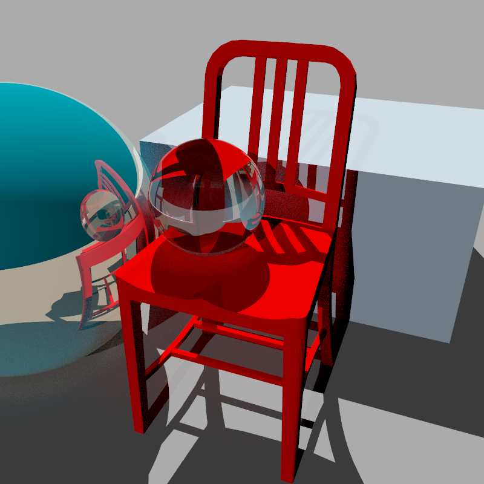

# zig-ray
A raytracer implemented in Zig. [lodepng](https://github.com/lvandeve/lodepng) is used to encode/decode png.
This is the result of running on `redchair.txt`

## Usage
`zig build -Doptimize=ReleaseFast`
\
`zig-out/bin/raytrace redchair.txt <thread_count>(default 1)`
\
This may take up to 5 mins on older machine.

